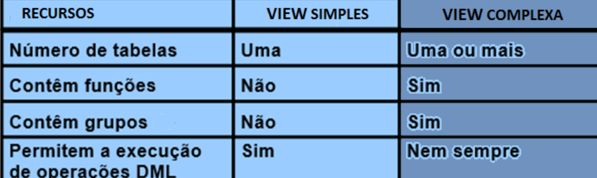

# Views

Uma visão corresponde a um conjunto de tuplas resultantes de uma consulta armazenada sobre um ou mais tabelas do SGBD. Os usuários podem utilizar a View para consultar seus conjuntos de dados como fariam sobre tabelas convencionais que armazenam dados fisicamente.

É uma tabela lógica baseada em uma ou mais tabelas reais, ou até mesmo sobre outra view.

A view em si NÃO contém dados, mas é semelhante a uma janela, por meio da qual é possível exibir, e até alterar alguns dados provenientes de tabelas que persistem no SGBD.

## Propriedades
* TABELA BASE -> tabela ou tabaleas na qual a view é baseada
* A view é armazenada como instrução SELECT no Dicionário de dados
* NÃO são objetos físicos e por isso não ocupam espaço em disco
* NÃO armazenam dados, pois não é uma tabela, sendo composta dinamicamente por uma consulta que é previamente analisada e otimizada pelo SGBD.


```CREATE VIEW CANDIDATOS_2004 (```
```registro, candidato, cargo, cidade, estado) AS```
```   SELECT p.codigo, p,nome, l.cargo, l.cidade, l.sigla```
```   FROM PESSOA p, LOCAL l```
```   WHERE p.idPessoa = l.idPessoa```
```   AND l.ano = 2004;```


* As alterações nos dados da tabela base da view alteram os resultados gerados pelas consultas armazenadas na view. (dinâmico)
* A criação de uma view é uma instrução DDL
* O uso de view simplifica a interação entre usuário final e o banco de dados
* A view pode ser usada como mecanismo de segurança, restringindo o acesso dos Usuários
* Em alguns bancos com tecnologia No-SQL, as vies são a única maneira de consultar dados

## Características
1. Aumento da segurança pois propicia uma visão limitada e controlada dos dados.
2. Melhora da performance, pois utilizará uma consulta previamente elaborada e otimizada.

* RESTRINGE acesso dos dados
* FACILITA consultas complexas
* PERMITE independencia de Dados
* APRESENTA exibições diferentes dos mesmos dados 

## Classificações
Podem ser SIMPLES ou COMPLEXAS
* Se diferenciam pela realização de operações DML (INSERT, UPDATE e DELETE) pela view, manipulando as tabelas reais(base).

### SIMPLES:
* Deriva dados de uma única tabela;
* Não contém funções ou agrupamento de dados;
* Permite a execução de operações DML.
### COMPLEXA:
* Deriva dados de várias tabelas;
* Contém funções ou agrupamento de dados;
* Nem sempre permite a execução de operações DML.
