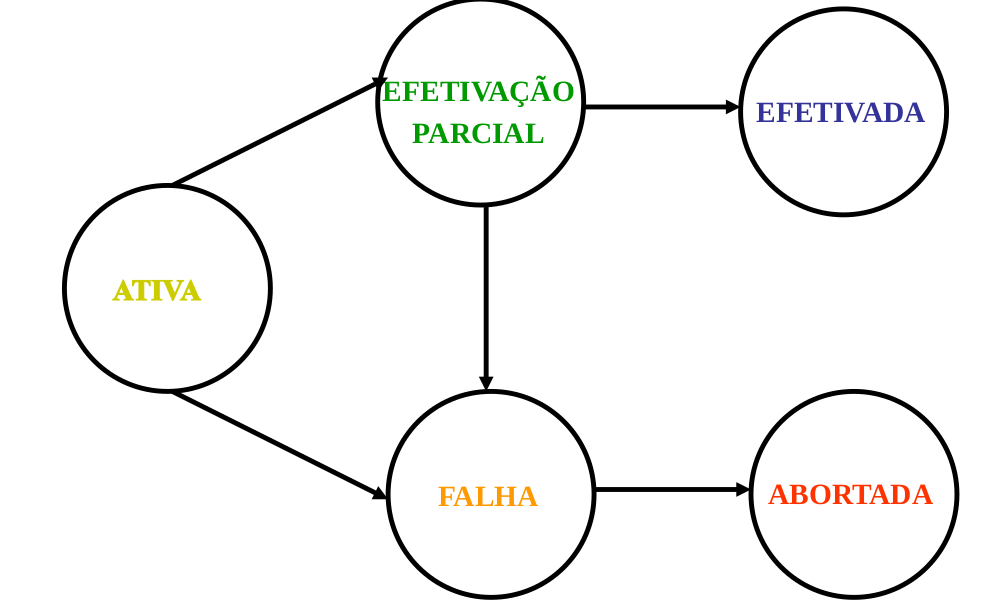

# Transação 

As operações que formam uma única unidade lógica de trabalho são chamadas de TRANSAÇÕES. Consiste em todas as operações a serem executadas a partir do começo até o fim da transação.

## Propriedades (A C I D)
Para assegurar a integridade dos dados:
* **Atomicidade**: Todas as operações da transação são refletidas corretamente no BDD ou nenhuma será.
* **Consistência**: A execução de uma transação isolada preserva a consistencia do BD (situação inicial e final)
* **Isolamento**: Cada transação não toma conhecimento das outras transações concorrentes. Assegurar a propriedade de isolamento é responsabilidade de um componente do sistema do BD, denominado CONTROLE DE CONSISTÊNCIA.
* **Durabilidade**: Depois da transação completar-se com sucesso, as mudanças que ela faz no BD persistem até mesmo se houver falhas no sistema.

## Estados da Transação

* ATIVA: permanece neste estado enquanto está sendo executada;
* EFETIVAÇÃO PARCIAL : após execução da última declaração;
* FALHA : descobre-se que a execução não poderá ser efetivada;
* ABORTADA : transação desfeita, restabelecendo o BD ao início; (**CONCLUÍDA**)
* EFETIVADA : após a conclusão com sucesso; (**CONCLUÍDA**)

## TRANSAÇÕES CONCORRENTES
O processamento de transações concorrentes agiliza a realização da tarefa desejada, mas também traz diversas complicações em relação a consistência dos dados no BD. Seria muito mais fácil manter as execuções das transações sequencialmente, mas duas possibilidades básicas incentivam
a concorrência e sua agilização:
* Operação da CPU e as E/S podem ser feitos em paralelo;
* Mistura de transações simultâneas no sistema
  * curtas;
  * longas;

* Acessa diferentes partes do BD;
* Reduz atrasos imprevisíveis;
* Diminui o tempo médio de resposta;
* Reduz ociosidade da CPU, discos e outros dispositivos.

* O processamento concorrente compromete a propriedade de consistência do BD. 
Para permitir a concorrência eficiente, sem comprometer a consistência, é analisada a **escala de execução** (schedules) das transações envolvidas.

* throughput do sistema: quantidade de transações que podem ser executadas em um determinado tempo
* Assim, o sistema de BD deve controlar a execução concorrente de transações para assegurar que o
estado do BD permaneça consistente, como se todas as suas transações fossem executadas serializadas
(processo de serialização seria garantido pelo SGBD)