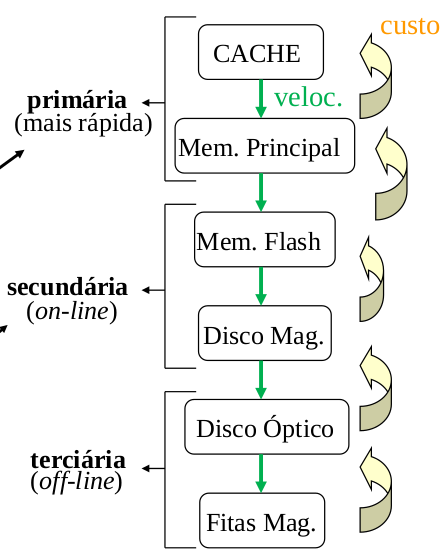

# Aula 2 - Arquivos

## Representação Simplificada de BD
* Aplicações: programas para manipular e consultar dados
* Gerenciador de Transações (GT): programas responsáveis pelo **processamento** de dados
* Gerenciador de Dados (GD): programas responsáveis pelo **acesso** aos dados
* Metadados: informações sobre os dados
* Banco de Dados (BD): conjunto de dados armazenados
* Sistema Gerenciador de Banco de Dados (SGBD): programas responsáveis pelo gerenciamento do BD.

## Armazenamento de Dados
### Registro
Conjunto de unidades de informação logicamente relacionada. Cada unidade de informação corresponde a um campo ou atributo do registro.

### Arquivo
Conjunto de registros armazenados em um dispositivo de memória ou armazenamento secundário. Recurso de armazenamento **persistente (não volátil)**.

A organização dos registros armazenados dentro de um arquivo pode ser variada e procura distribuir as unidades de informação de maneira mais eficiente ao seu uso.

## Visão Geral dos Meios Físicos de Armazenamento

1. **CACHE**: Forma de armazenamento **mais rápida e cara**, sendo pequena e controlada pelo Sistema Operacional do computador.
2. **Memória Principal**: mídia de armazenamento para os dados que estão disponíveis ao uso e processamento do computador.
3. **Memória Flash** (EEPROM): velocidade próxima a memória principal, mas armazenamento é mais trabalhoso, pois precisa apagar tudo de uma vez para regravação.
4. **Disco Magnético**: mídia primária para o armazenamento de dados por longos períodos, além do acesso online (normalmente se tem um BD inteiro armazenado nele).
5. **Disco Óptico**: dados são armazenados opticamente e lidos por laser, podendo ser trocados por outros discos ópticos.
6. **Fita Magnética**: dispositivos **mais baratos e lentos** pois precisam ser acessados sequencialmente.

### Aspectos importantes para escolha de Memória
* Custo
* Velocidade
* Capacidade de armazenamento

* **Primárias**: mais rápidas, mas há perda de dados com falta de energia (volátil)
* **Secundárias**: online. Os discos magnéticos fornecem o maior volume de memória secundária dos sistemas computacionais modernos.
* **Terciária**: Offline. As fitas são normalmente usadas para backup e armazenamento de dados, possuem grande capacidade de armazenamento e podem ser removidas da unidade de fita (trocadas)

## Arquivos

### Sequenciais
* Registros são dispostos ordenadamente, obedecendo a sequência determinada por uma chave primária, chamada chave de ordenação
* Acesso aos registros feitos sequencialmente
* Aperfeiçoa o armazenamento de registros dispostos aleatoriamente no arquivo
* Existe perda de flexibilidade na realização de operações de modificação dos dados no arquivo.
* Indicado no acesso de registros usando argumentos que coicidam com a chave de ordenação ou tem atualizações por lotes (arquivos batch).

### Sequenciais Indexados
* Grande volume de acesso aleatória sobre os arquivos sequenciais exige uso de uma estrutura de indexação.
* O índice é formado por uma coleção de pares, associando um valor da chave de acesso a um endereço físico no arquivo.
* Possui áreas de extensão, usadas para inserção de novos arquivos.

### Diretos
* Instalação dos registros em endereços determinados com base no valor de uma chave primária.
* Acesso rápido aos registros especificados por argumentos de pesquisa.
* Não há necessidade de percorrer um índice.
* Eficiência no acesso aleatório, usando a chave do prórpio registro ou uma função que calcula o enderço do registro a partir do argumento de pesquisa (hash).
* Indicado para uso em aplicações com atualizações arbitrárias.

| Tipo de Arquivo | Principal Vantagem | Principal Desvantagem |
|-----------------|--------------------|-----------------------|
| Sequencial | Acessos sequenciais mais eficientes | Operações de modificações mais complexas |
| Sequencial indexado | usam índices que agilizam a consulta e parmanecem em memória | Necessidade de áreas extensão que ainda precisam ser reorganizadas |
| Direto | Acesso direto, sem necessidade do índice (menor espaço ocupado) | É necessário determinar funções que gerem menor número de colisões |

## Operações algorítmicas sobre arquivos
* Abrir arquivos
* Fechar arquivos
* Recuperar registro do arquivo
* Inserir novo registro no arquivo
* Aletrar um registro existente no arquivo
* Apagar um registro do arquivo