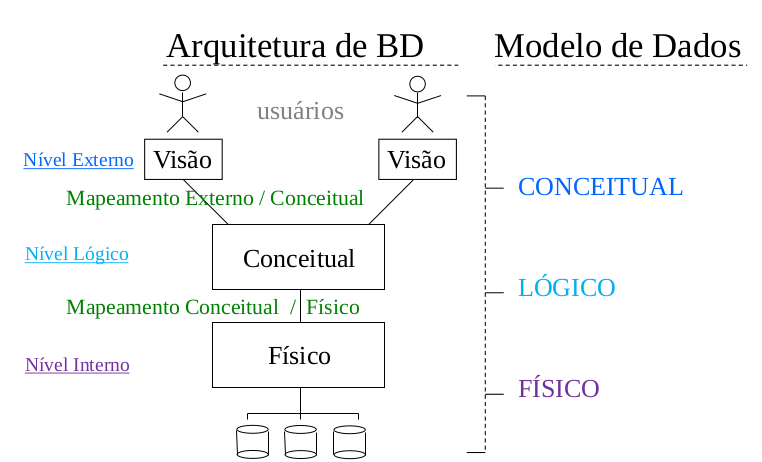

# Aula 3 - SGBD

O objetivo de um sistema de banco de dados é oferecer uma visão **abstrata** dos dados aos usuários. A forma como estesd ados estão armazenados e mantidos não interessa aos seus usuários, mas a *disponibilidade eficiente* desses dados é fundamental.

**Abstração** está associada à característica de se observar somente os aspectos de interesse. 
Para o contexto de BD: não se considerar a forma como os dados são armazenados fisicamente.

**Definição** do BD envolve especificar estruturas e tipos de dados para serem gravados, com uma descrição detalhada de cada tipo de dados e suas características.

**Construção** do BD é o processo de gravar (popular) inicialmente os dados no BD.

**Manipulação** do BD inclui funções como consultar por dados específicos e atualizar para refletir as atlerações possíveis no mundo real.

**METADADO = DICIONÁRIO E CATÁLOGO**

## Dado x Informação
* **Dado**: fato que pode ser registrado e possui significado implícto.
* **Informação**: organização em relação a um conteúdo.

## Perfis envolvidos
* Administrador de Dados (DBA): 
  * Supervisor do BD, responsável pela autorização de acesso ao banvo, monitoramento e coordenação de seu uso
  * Está envolvido com os aspectos físicos do banco - estruturas de armazenamento, métodos de acesso.

* Projetista do Banco:
  * Responsável pela identificação dos dados e elaboração de estruturas apropriadas.
  * Compreende os requisitos necessários aos usuários.

* Analista de Sistemas:
  * Determina os requisitos dos usuários e desenvolvem especificações que atendam esses requisitos.

* Programadores:
  * Implementam as especificações

## Sistema Gerenciador de Banco de Dados Relacional (SGBDR)

### Características relevantes

* **Controle sobre a redundância**
  * Espaço para armazenamento
  * Duplicação de esforços
  * Inconsistência na base de dados

* **Compartilhamento de Dados**
  * Se diversos usuários tem aplicações integradas no BD, precisa-se de um software de controle de concorrência para a atualização do banco.
  * Facilidade na definição da visão do usuário, especificando uma porção do BD (parte) que tem interesse particular de um grupo de usuários.

* **Restrição de acesso não autorizado**
  * Distema de sugurança garantindo acesso específico a cada usuário (personalizado a grupos ou individual)
    * Segurança no acesso ao BD
    * Permissão de operação no BD
    * Proteção de contas pessoais por senhas
    * Constante preocupação do DBA e identificação dos perfis elaborados pelo Analista e o Projetista
  * Segurança no uso do próprio SGBD como na criação de novas contas e suas permissões específicas

* **Fornecimento de múltiplas interfaces**
  * Diversos níveis de conhecimento entre os usuários, em que o BD deve oferecer vários tipos de acesso aos seus dados armazenados.
    * Linguagem para consulta de usuários casuais
    * Linguagem de programação para se programar aplicações diversas que acessam os dados
    * Formulários e menus para acesso de outros usuários

* **Forçar restrições de integridade**
  * São regras associadas aos dados respeitando a coerência na representação do mundo real.
    * Identificação do tipo de dado (mais simples restrição)
    * Unicidade de dado (chave adequada)
    * Impossibilidade do dado não ser informado (ser nulo)
    * Relacionamento entre os dados armazenados
  * Dificultar o erro, mas ele ainda pode acontecer
  * Alguns SGBD facilitam a definição de novos tipos de dados em adição aos tipos básicos.

* **Sistema de Backup e Recovery**
  * Facilidade e controle do BD no caso de falha do hardware ou software, chegando a fazer uma recuperação da situação anteriormente encontrada.

### Vantagens adicionais na abordagem de BD

* **Desenvolvimento de padrões**: permite ao DBA definir e forçar padrões (nomes, formatos, terminologias...), facilitanto a comunicação e cooperação entre os setores, projetos e usuários dentro da organização.
* **Flexibilidade**: algumas alterações na estrutura do BD não afetam *muito* as aplicações existentes.
* **Tempo de desenvolvimento reduzido**: Projetar e implementar uma nova aplicação é mais rápido em um BD existente do que se ele não existisse ou fosse feito sobre a abordagem tradicional de Arquivo de Dados.
* **Disponibilidade de informação atualizada**: torna o BD disponível para todos os usuários (que tenham permissão de acesso) devido ao controle de concorrência e recuperação do SGBD.

## Quando não usar um SGBD
* Custo desnecessário a abordagem tradicional de arquivos
* Alto investimento inicial com software e hardware
* Aplicações de tempo real com um overhead de sugrança, controle de concorrência, recuperação e funções de integridade
* BD simples com aplicações bem definidas, não esprando muitas alterações
* Múltiplos acessos não necessários

## Principais atribuições do SGBD
* BD não contém somente os dados de conteúdos armazenados, ele também armazena definições e descrições sobre a estrutura que forma tal banco de dados (**metadados**).
* O catálogo do sistema (metadados) contém definições da estrutura de cada arquivo, tipo de dado e formato de armazenamento de cada item de dados, além de várias possíveis restrições coerentes com as exigências dos dados no mundo real.
* Este catálogo ou dicionário, é usado pelo SGBD e ocasionalmente por algum usuário do BD. 

