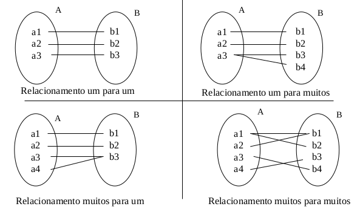
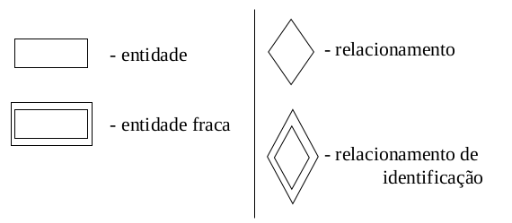
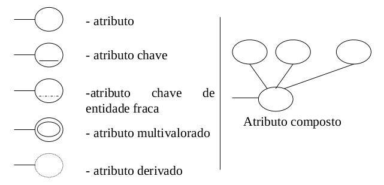

# Aula 4 - Modelo Entidade Relacionamento

É baseado na percepção do mundo real que consiste em um conjunto de objetos básicos chamados **Entidades** e nos **Relacionamentos** entre estes objetos. Foi desenvolvido para facilitar o projeto de banco de dados, permitindo a **especificação de um esquema de negócio**, em que tal esquema representa a estrutua lógica geral do BD.

## Entidade
* Conjunto de objetos da realidade modelada sobre os quais deseja-se colecionar dados no BD.
* Pode ser concreta ou abstrata
* Representa um conjunto de objetos que se deseja guardar dados e é importante para o seu mundo real.

**Exemplo**: Um sistema bancário tem as seguintes entidades: clientes, contas, cheques, agências. A entidade cliente representa o conjunto de clientes que se deseja manter dados no BD.

## Relacionamento
*Conjunto de associações entre as Entidades.*

* Um conjunto de relacionamentos é uma coleção de ocorrências das entidades relacionadas (associadas).
* A função que uma entidade exerce em um relacionamento é chamada de **papel**, normalmente implícito, mas muito esclarecedor ao mundo real que se está representando.
* Também pode ter atributos descritivos onde ocorre tal relacionamento. (ex: data, hora...)
* A ocorrência de um relacionemto particular dentro de um conjunto de relacionementos de um mesmo tipo é chamda de **instância do relacionamento**.

## Atributo
O dado que é associado a cada ocorrência de uma entidade ou um relacionamento.
* Uma Entidade é representada por um único ou vários (conjuntos) atributos.
* Para cada atributo existe um conjunto ded valores permitidos, chamado **domínio** daquele atributo.
* O atributo mapeia uma entidade em um domínio.

## Chave
Um ou mais atributos que permitem identificar unicamente uma entidade no conjunto de registros da entidade.
* **Chave Candidata**: é o atributo, ou a composição de mais que um atributo, que pode identificar unicamente uma entidade.
* **Chave Primária**: define a chave candidata escolhida pelo projetista de dados para identificar unicamente os registros em uma entidade

## Cardinalidade
Restrição de mapeamento que expressa o número de entidades as quais outra entidade pode er associada via um conjunto de relacionemntos.

## Notação utilizada no DE-R

## Generalização e Especialização
* Generalização: usada para enfatizar as semelhanças entre tipos de entidades de nível superior e ocultar suas diferenças.
* Especialização: consiste na identificação de subgrupos de entidades que são, de alguma forma, diferentes de outras entidades do conjunto.

* Representados por um triângulo, podendo ser:
  * Total: há pelo menos uma Especialização
  * Exclusiva: há somente uma única Especialização
  * Parcial: pode não ter nenhuma Especialização.

## Autorrelacionamento
Caso particular que pode ser verificado em diversas situações e respeita as cardinalidades, mas envolvendo uma mesma entidade.

## Agregação
Uma limitação do MER é que não é possível expressar relacionamentos entre relacionamentos. A agregação ou **entidade associativa** é uma abstração por meio da qual relacionamentos são tratados como entidades de nível superior.

Essa nova entidade surge na representação do DER, permitindo que possa existir um relacionamento ligado a outro.

## Relacionamentos Ternários
Alguns relacionamentos entre entidades podem ser representadas por relacionamentos ternários, em que a representação no DER é mostrada de forma mais objetiva, mas a implementação física corresponderá a dois relacionamentos.

Relacionamentos ternários apresentam ocorrências de 3 entidades. Só é interessante utilizar este tipo de relacionamento quando realmente for obrigatório associar, ao mesmo tempo, um par de entidade com uma terceira entidade. Quando não ocorre esta obrigatoriedade, recomenda-se o uso da agregação.

A determinação da cardinalidade de um relacionamento ternário é feita questionando um par em relação à terceira entidade envolvida.

## Descrição da Relação
Descrição do esquema ALUNO:
>
> ALUNO (
>
> matricula   **numérico(8)**   NÃO NULO,
>
> nome        **literal(30)**   NÃO NULO,
>
> nascimento  **data**          NÃO NULO,
>
> cpf         **numérico(11)**, 
>
> telefone    **numérico(12)**,
>
> restrição ALUNO_PK de Chave Primária (matricula),
>
> );