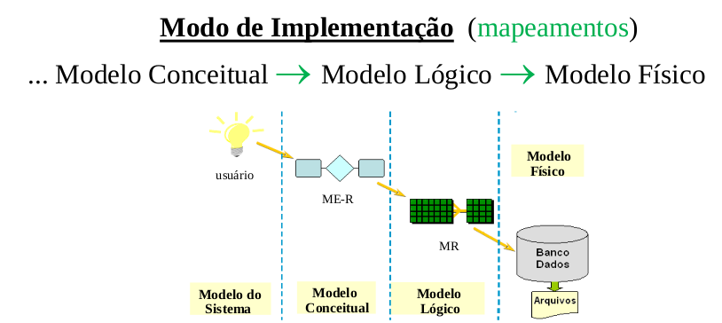
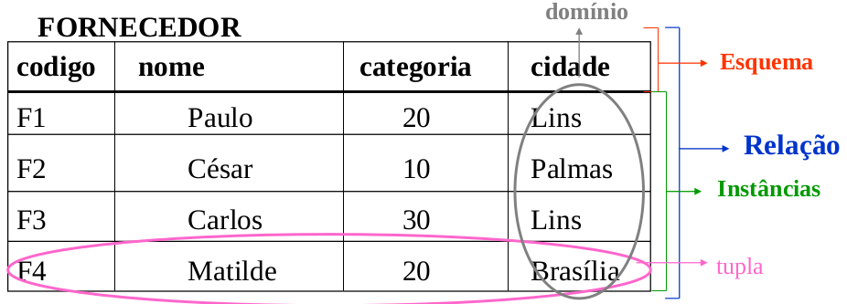

# Modelo Relacional de Dados

**Modelo de Dados** é um conjunto de conceitos utlizados para descrever a estrutura de um banco de dados. É a principal ferramenta no fornecimento de informações sobre a abstração efetuada.

### Esquema
* Descrição da organização dos dados de m BD.
* Um esquema de BD é especificado durante o projeto do BD e não é frquentemente modificado.

### Instância
* Os dados armazenados em um BD, em um momento específico, são denominados instâncias do BD (seria a fotografia do BD em um instante)

  

**Modelo Relacional** representa os dados em um BD por meio de um *conjunto de relações* (TABELAS). Estas relações contém informações sobre entidades ou relacionamentos existentes no *domínio da aplicação* utilizada como alvo da Modelagem.

Informalmente, um relação pode ser considerada como uma *tabela de valores*, em que cada linha desta tabela representa uma *coleção de valores de dados inter-relacionados*.

### Terminologia do Modelo Relacional

| Nome | Descrição |
| - | - |
| Tupla | linha da tabela |
| Relação | Tabela |
| Atributo | nome da coluna |
| Domínio | conjunto de valores que cada atributo pode assumir em uma relação |
| Esquema | conjunto de atributos que descreve as características dos elementos da relação|

* A quantidade de atributos em uma relação é denominado **Grau da Relação**.

## Características das Relações (tabelas)
* Não há tuplas duplicadas em uma relação.
* A ordem das tuplas não é relevante para diferenciar uma relação de outra.
* Existe ordem dos valores nas tuplas, uma vez que o cabeçalho da relação (ou esquema) é definido como um conjunto de atributos.
* Os valores dos atributos devem ser atômicos, não sendo divisíveis em componentes.
    * Atributos multivalorados são representados por
meio de uma outra relação;
    * Atributos compostos são pelos seus componentes.