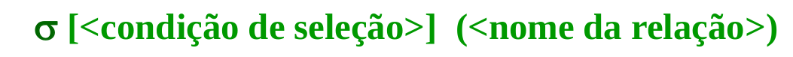
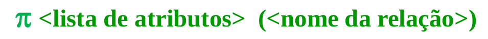
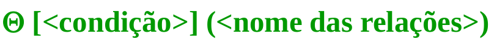

# Álgebra Relacional

## Operadores de Conjuntos
* Se aplicam quando as duas relações obedecem a **Compatibilidade de União**, ou seja, ambas devem apresentar respectivamente os mesmos domínios.

### União (U)
* Resultado = conjunto de todas as tuplas que pertençam a ambas as relações.

### Interseção (∩)
* Resultado = conjunto de todas as tuplas que aparecem ao mesmo tempo nas duas relações.

### Diferença (-)
* Resultado R-S = conjutno de tuplas que aparecem em R, mas não aparecem em S.
* A ordem das relações importa para o resultado final.

### Produto Cartesiano (X)
* Resultado = relação que apresenta tuplas formadas pela combinação dos atributos pertencentes a amabas as relações.
* NÃO precisa ter compatibilidade de união.
* Relação de Pares

## Operadores Relacionais
Uma opreção relacional sempre resulta em uma outra relação que pode ser usada na elaboração de consultas mais complexas.

### Operadores de Seleção (SELECT)
* Resultado = relação contendo tuplas com os mesmos atributos de relação que satisfazem a uma determinada condição de seleção.
* Operador unário, sendo executado sobre apenas uma relação, uma tupla por vez.
* Pode usar os operadores relacionais (!=, =, <, >, <=, =>) na expressão de seleção.
* Pode ser composta por mais que um predicado condicional interligados pelos conectivos E(^) OU(v) lógicos.

### Operadores de Projeção (PROJECT)
* Resultado = exibição dos atributos de um relação, na mesma ordem de definição.

### Operações de Junção (JOIN)
* Resultado = combinação de tuplas relacionadas de duas relações em uma tupla simples, realizada de acordo com uma condição indicada.

## Funções Agregadas
Consistem em funções que podem ser aplicadas a valores numéricos. Elas são:
* Avarage (média aritmética)
* Count (contador)
* Sum (soma)
* Maximum (maior)
* Minimun (menor)

