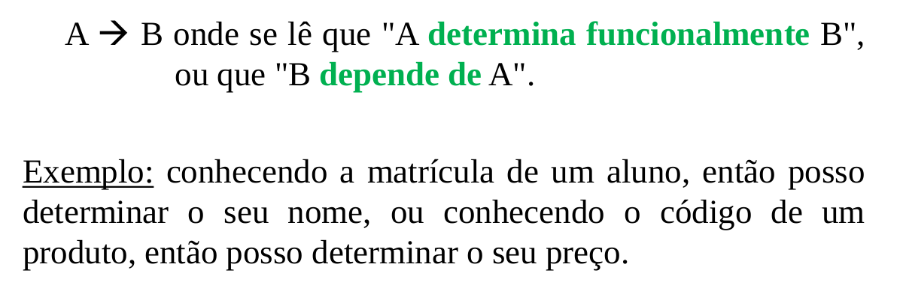
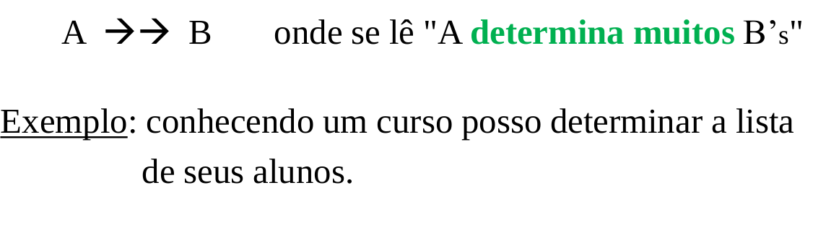
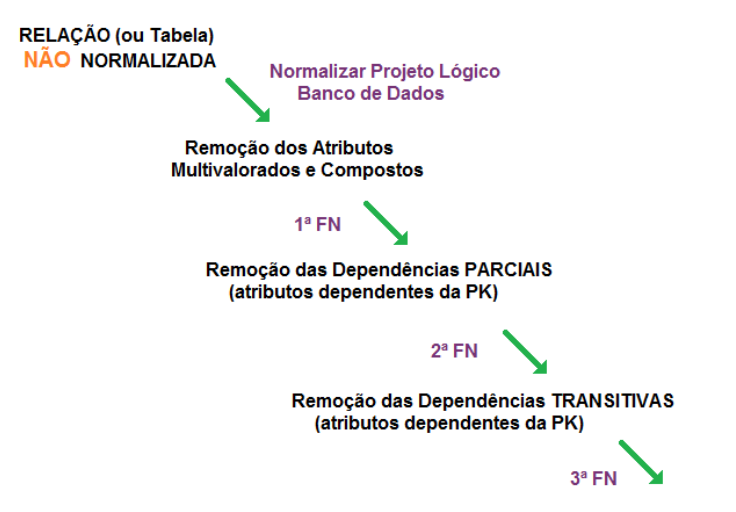

# Controle de Consistência, Dependência Funcional e Normalização

# Controle de Consistência
No modelo Relacional, cada esquema de uma relação possui um **número de atributos**(grau da relação), enquanto que o esquema de um BD relacional consiste em uma séria de esquemas de relações.

A avaliação de um mapeamento proposto por um projetista, ou resultado de um MER, deve respeitar algumas características que o conceitue como um mapeamento eficiente. (De forma consistente e com mínimo de redundância)

## Critérios informais
### Semântica dos atributos de uma relação
Sempre que um conjutno de atributos é agrupado em uma relação, um determinado significado é associado a eles. Este significado (ou semântica) identificam como devem ser interpretados os atributos pertencentes a cada tupla da relação.

### Redundância de Valores
Sempre deve-se evitar a definição de dados em mais que um local (esquema) no BD, ou seja, a duplicação/redundância dos dados no BD.

### Valores nulos em tuplas
Um atributo que possua valor nulo permite diferentes interpretações:
1. Atributo não se aplica para esta tupla.
2. Valor do atributo para esta tupla é desconhecido.
3. Valor é conhecido, mas encontra-se ausente (não foi inserido)

Sempre procure evitar atributos que possam ser nulos. Quando for inevitável, verifique se estas tuplas acontem em pequeno número na relação.

   
O controle de consistência dos dados pode ser exercido em três níveis:
1. pelo gerenciador(SGBD)
2. pelo programa ou aplicativo
3. pela própria construção do sistema

De uma forma geral o controle de consistência obtido pela própria construção do sistema é mais eficiente, pois normalmente não implica em perda de desempenho do SGBD durante a sua execução. 

O controle por meio da própria construção do sistema é obtido, no Modelo Relacional, construindo as relações segundo regras que garantem a manutenção de certas propriedades. As relações que atendem a determinadas regras diz-se estarem em uma determinada "Forma Normal".

## Normalização
O processo de normalização pode ser considerado como a aplicação de uma série de regras e normas, que constituem as Formas Normais.

Permite o projetista controlar o quanto de consistência será garantida pela maneira de construção do sistema, e quanto deve ser de responsabilidade dos aplicativos e/ou SGBD.

* Normalizar demais pode diminuir a eficiência dos aplicativos que utilizam o BD.
* Normalizar de menos facilita as possibilidades de inconsistências no BD.

## Dependência Funcional
Baseia-se no reconhecimento que os valores de alguns atributos contribuem na identificação de outros. Uma dependência funcional significa que ao se conhecer o valor de um atributo, então pode-se sempre determinar o valor de outro. A notação usada na teoria relacional é:

Uma dependência multivalorada significa que ao se conhecer o valor de um atributo, então pode-se sempre determinar os valores de um conjutno de atributos. A notação usada na teoria relacional é:

Uma das maneiras de controlar a consistência é por meio de **Dependências Funcionais** existentes entre os atributos armazenados.

## Formas Normais
### 1FN - Primeira
Uma relação se encontra na Primeira Forma Normal se todos os domínios de atributos possuírem apenas valores atômicos (simples e indivisíveis). Com isso, a relação é construída sem atributos compostos e multivalorados em suas tuplas.

### 2FN - Segunda
Uma relação está na Segunda Forma Normal quando ela está na 1 FN e todos os atributos que não participam da chave primária são dependentes diretos de toda a chave primária.

Para a normalização de uma relação para 2FN:
1. Verificar os grupos de atributos que dependem da mesma parte da chave primária.
2. Retirar da relação todos os atributos de um desses grupos
3. Criar uma nova relação contendo esse grupo como atributo não chave, e os atributos que determinam esse grupo como chave primária.
4. Repetir o procedimento para cada grupo, até que a relação toda somente cotenha atributos que dependam da chave primária.

### 3FN - Terceira
Uma tabela está na Terceira Forma Normal se estiver na 2 FN e não possuir dependências transitivas (ou indiretas). Uma dependência transitiva acontece quando: A -> B e B -> C, logo A -> C. Em outras palavras, deve-se evitar que qualquer atributo não chave seja dependente funcional de outro atributo não chave. 

Da mesma forma que a 2 FN, a normalização para a 3 FN evita a inconsistência devido a duplicidade de dados, além da perda de dados em operações de remoção ou de alterações na relação.

